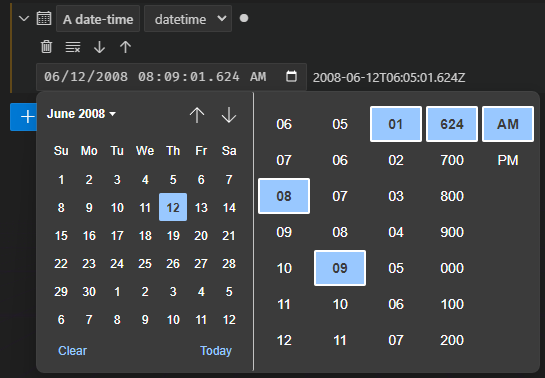
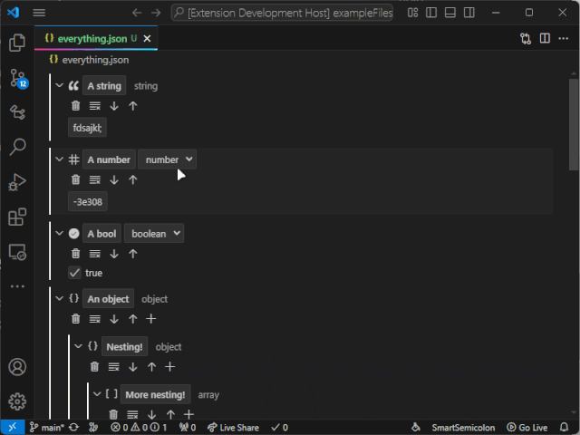

# Visual JSON Editor

Open JSON files in a GUI that looks (kind of) like the VS Code settings page! Includes type changing, item rearrangement, undo/redo, and assistance with colors, dates, and times.

## Features

### Edit Names & Values

Names are validated:

Strings have multi-line support:

Numbers are validated and aren't constrained by JS limits:

Booleans become checkboxes:

Full support for object and array nesting:

6-digit hex codes give you the Chromium color picker:

Finally, ISO 8601 zoneless date-time strings give you the Chromium `datetime-local` picker:

### Type Conversion

Convert certain types of item to other types using the dropdown box.

If something's "stuck" as a certain type, use the clear button to nullify it and try again.

### Rearrange Items

Use the up and down arrows to move an item around the "layer" it's in.

### Theme Compatible

All colors are pulled from your current color theme.

## Extension Settings

This extension contributes the following settings:

* `visual-json.outputPrettiness`: Number of space characters to indent saved JSON files by, or 0 to save in one line. Defaults to 2 spaces. (This gets passed as the [`space` parameter of `JSON.stringify()`](https://developer.mozilla.org/en-US/docs/Web/JavaScript/Reference/Global_Objects/JSON/stringify#space).)
* `visual-json.maxFileSize`: Maximum file size (in kilobytes) the editor will open before displaying an error message. Defaults to 256 KB.

## Known Issues

* The same file cannot be open in multiple instances of the editor. This was done intentionally to avoid the complexity of syncing state between them.
  * The editor doesn't sync its state with text editors that have the same file open, either. Not sure if that's even possible.
* Tab-key navigation has not yet been implemented - sorry, keyboard warriors, you'll need your mouse for this.

## Version History

### 1.0.0

* Initial release
